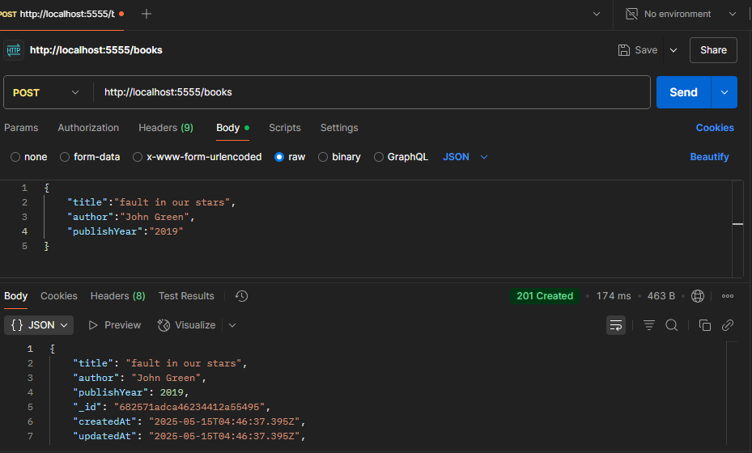
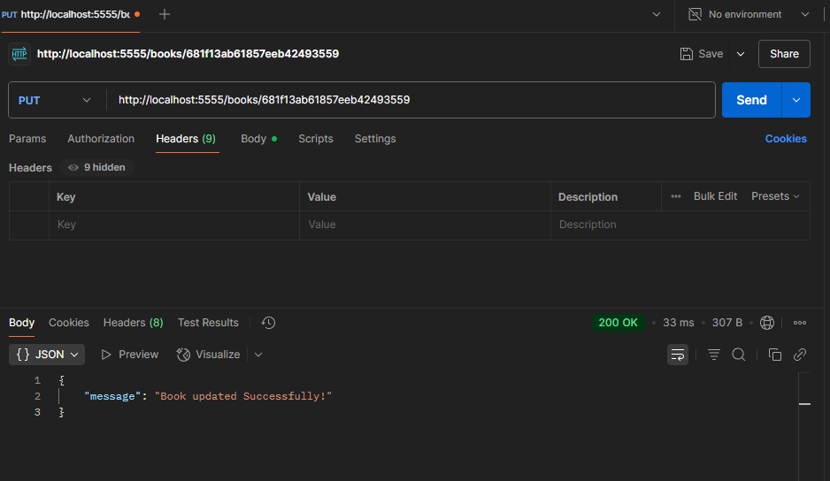
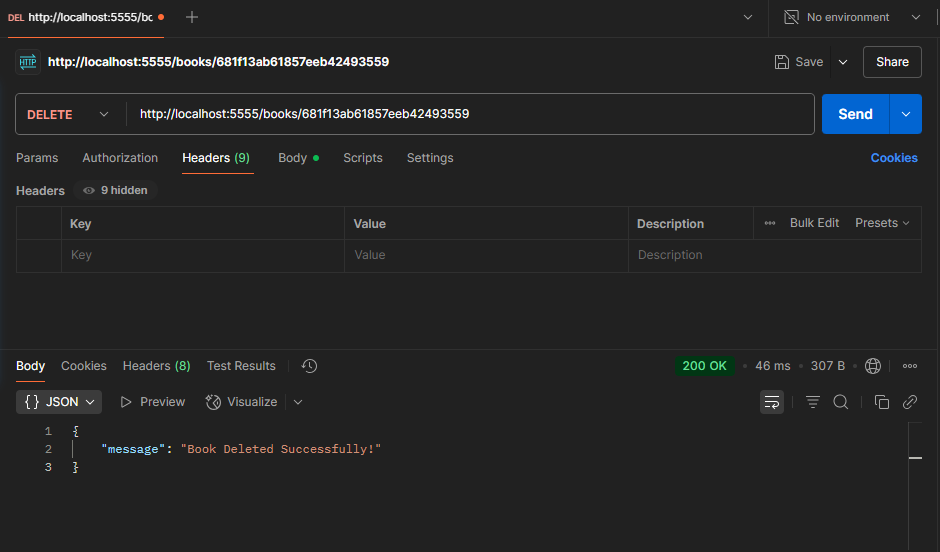

 MERN Stack Internship Project

## Project Overview

This is a MERN (MongoDB, Express.js, React.js, Node.js) stack project developed as part of an internship program. The project focuses on building a fully functional backend API with complete CRUD (Create, Read, Update, Delete) operations.

*Note:* The backend is fully functional and tested using Postman. The frontend was initialized using the Vite + React framework but could not be completed due to technical issues.

---

## Features Implemented (Backend)

- RESTful API using *Express.js*
- MongoDB integration via *Mongoose*
- API routes supporting:
  - *POST* – Create new data
  - *GET* – Retrieve existing data
  - *PUT* – Update existing data
  - *DELETE* – Remove data
- Error handling and status code responses
- Tested with *Postman*

---

## Tech Stack

- *Frontend:* React.js with Vite (incomplete)
- *Backend:* Node.js, Express.js
- *Database:* MongoDB
- *Testing Tool:* Postman

Below are screenshots from Postman verifying the working API routes:

- *GET /api/items* – Fetch all items  
  ![GET Request]
  

- *POST /api/items* – Create a new item  
  ![POST Request]

- *PUT /api/items/:id* – Update an item  
  ![PUT Request]

- *DELETE /api/items/:id* – Delete an item  
  ![DELETE Request]